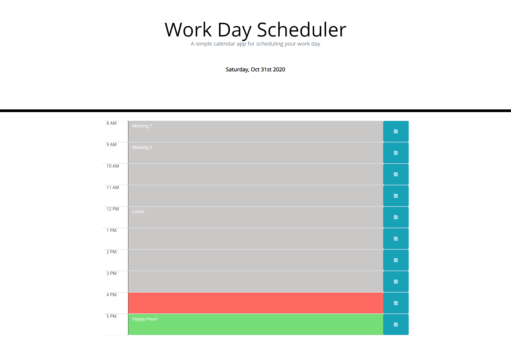

# Work Day Scheduler Starter Code

## Usage

Quickly track and plan daily work tasks

## Deployed App

https://minnesotanyst.github.io/scheduler/

## Description

- Features inclue:
  - Displays current workday
  - Color code time of day based on PC time
  - Saves new task on button click

## Technology Stack

CSS, HTML, Javascript, Moment.js

## Credits

MDN web docs, Stackoverflow

## Future enhancements

- Enhance CSS / add 3rd party web API
- Add ability to mark tasks off when complete
- Add ability to store and view previous workday tasks

## Screenshot

